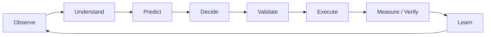
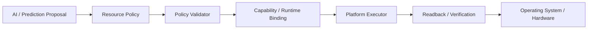
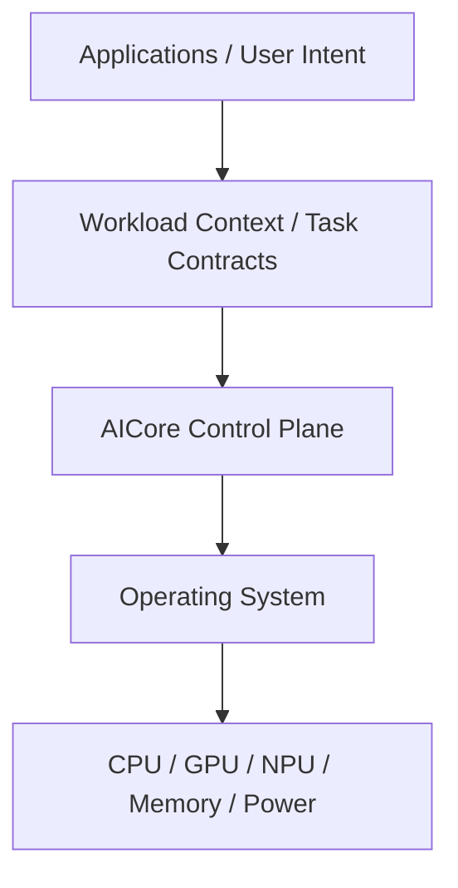

# AICore

> **AI-assisted adaptive computer control layer for heterogeneous PCs**

**Status:** Proprietary engineering prototype
**Current generation:** AICore V4 / workspace version 0.4.0
**Primary implementation:** Rust
**Target platforms:** Windows and Linux
**Source availability:** Proprietary — core implementation is not publicly distributed

AICore is an experimental computer control layer that sits conceptually between applications and operating-system / hardware resource interfaces. It combines system telemetry, workload context, application task intent, historical information, and optional local AI inference to produce **validated, observable, and reversible resource-control policies**.

AICore is not a replacement operating system, a chatbot, or a collection of fixed "PC optimization" switches. The project explores whether a local control plane can help increasingly heterogeneous computers coordinate resources around the workload that is actually being executed.

## The problem

Modern PCs increasingly combine:

- CPU compute
- integrated and discrete GPUs
- NPUs and other AI accelerators
- shared and dedicated memory
- multiple power states
- thermal and battery constraints
- interactive, background, rendering, compilation, gaming, and AI workloads

Resource decisions are distributed across applications, operating systems, runtimes, drivers, and vendor-specific interfaces. AICore explores an additional coordination layer that can reason about workload context while preserving deterministic validation and platform control boundaries.

## Control model

AI is deliberately **not** given direct privileged control:

Unsupported, stale, invalid, or failed decisions can be rejected, degraded, rolled back, or moved into a safe operating path.

## System position

AICore does **not** replace the operating system, kernel, GPU/NPU firmware, vendor drivers, or application business logic.

## What exists in V4

The private V4 implementation currently contains engineering work in the following areas:

- adaptive runtime control loop
- workload and context representation
- policy generation, resolution, and validation
- Windows and Linux platform adapters
- process priority and CPU-affinity control paths
- power-profile integration
- GPU telemetry and capability-gated hardware-control primitives
- NPU capability and routing abstractions
- optional AI-assisted policy proposals
- optional local LLM intent interpretation
- application/task contracts
- L0 / L1 / L2 compatibility tiers
- execution readback and post-condition verification
- rollback, degraded operation, and SafeMode concepts
- local IPC
- plugin architecture and trust controls
- historical memory / persistence infrastructure
- CLI and local telemetry dashboard
- model mode and captured-fixture platform simulation
- automated engineering verification infrastructure

See [Current Status](docs/CURRENT_STATUS.md) for the important distinction between implemented architecture, verified engineering behavior, and capabilities that are **not yet proven on real heterogeneous hardware**.

## What AICore does not claim today

AICore currently has **no public cross-hardware performance benchmark dataset**. This repository therefore does not claim that AICore:

- increases gaming FPS
- reduces compilation time
- improves AI inference throughput
- extends battery life
- reduces energy consumption
- improves thermals
- universally controls arbitrary GPUs or NPUs
- replaces the Windows or Linux scheduler

Real workload and cross-hardware validation is the next major stage of the project.

## Integration tiers

AICore uses three independent compatibility tiers:

| Tier         | Purpose                                                                             |
| ------------ | ----------------------------------------------------------------------------------- |
| **L0** | Transparent workload/context integration without requiring application modification |
| **L1** | Application-provided task contracts and resource intent                             |
| **L2** | Native AICore task submission, query, and cancellation interfaces                   |

The tiers communicate through shared contracts rather than depending directly on each other's implementation.

## Why the implementation is private

AICore is being developed as **proprietary technology**. This public repository exists to document the project's purpose, architecture, engineering status, and development direction without distributing the core source code, private models, platform-control implementation, internal test infrastructure, or proprietary technical assets.

This is a **technical showcase repository**, not the AICore source repository.

## Documentation

- [Project Overview](docs/OVERVIEW.md)
- [Public Architecture](docs/ARCHITECTURE.md)
- [Capabilities](docs/CAPABILITIES.md)
- [Current Status &amp; Evidence Boundary](docs/CURRENT_STATUS.md)
- [Safety &amp; Control Principles](docs/SAFETY_AND_CONTROL.md)
- [Roadmap](docs/ROADMAP.md)
- [Technical FAQ](docs/FAQ.md)

## Feedback

Technical feedback is especially welcome from people working in:

- operating systems
- performance engineering
- heterogeneous computing
- AI PCs
- power and thermal management
- GPU / NPU runtimes
- local AI infrastructure
- systems programming

For technical/partnership/licensing inquiries: **kenny98929974@gmail.com**

---

**AICore is a private engineering prototype. Public documentation describes the project but does not grant access to or rights in the private implementation.**
