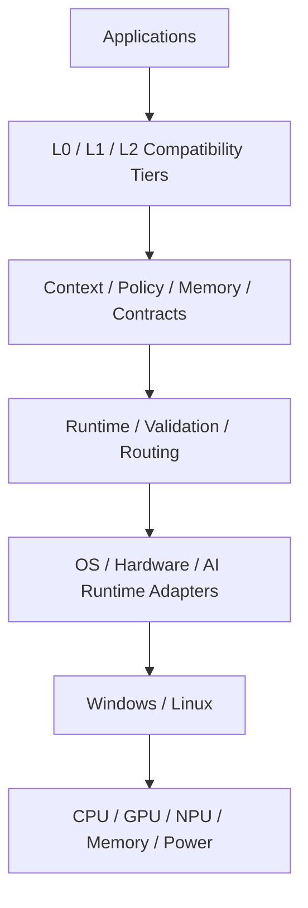
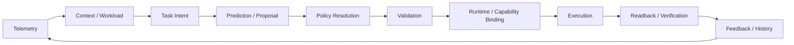
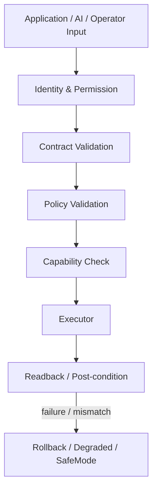

# Public Architecture

This document intentionally describes AICore at a **public architectural level**. It does not document private implementation details, internal algorithms, proprietary model assets, or platform-control source code.

## System boundary



AICore owns the coordination logic around context, policy, validation, orchestration, compatibility, execution state, and feedback.

AICore does not own application business logic, operating-system kernels, vendor firmware, or hardware-driver implementations.

## Closed control loop



A control tick is not considered successful merely because a command was requested. Requested state, execution result, and observed state are distinct concepts.

## Safety boundary



## Fast and slow paths

AICore's architecture separates slower intelligence work from time-sensitive execution.

```text
Slow path
Telemetry enrichment
History
Prediction
Optional local AI
Policy preparation
        │
        ▼
Prepared, time-bounded policy
        │
        ▼
Fast path
Freshness check
Validation
Capability binding
Execution
Readback
```

This avoids making a slow AI provider the real-time authority for system control.

## Compatibility tiers

### L0 — transparent integration

AICore infers workload/context from available system information. Applications do not need to know AICore exists.

### L1 — task contract

An application can explicitly describe task information such as workload type, priority, latency sensitivity, power preference, privacy requirements, or accelerator requirements.

### L2 — native AICore task runtime

Applications can use AICore task lifecycle interfaces to submit, query, and cancel work.

These tiers are designed to remain independently replaceable and communicate through stable contracts.

## Platform abstraction

Platform capabilities are discovered and represented explicitly. A policy is not equivalent to a guarantee that a particular machine can execute it.

Examples of capability domains include:

| Domain | Windows | Linux | Public status |
|---|---|---|---|
| CPU telemetry | supported path | supported path | implemented |
| Process priority | supported path | supported path | implemented |
| CPU affinity | supported path | supported path | implemented |
| Power profile | supported path | capability-dependent | implemented / capability-gated |
| GPU telemetry | vendor/runtime-dependent | vendor/runtime-dependent | partial / capability-gated |
| NPU telemetry | vendor/runtime-dependent | vendor/runtime-dependent | incomplete |
| GPU control | capability-gated | capability-gated | partial |
| NPU control | capability-gated | capability-gated | incomplete |

"Implemented" does not mean certified across every hardware configuration. See [Current Status](CURRENT_STATUS.md).

## Local interfaces

The private implementation includes local IPC and a telemetry/dashboard data path. Windows uses a local named-pipe path; Linux uses local IPC appropriate to the platform.

The architecture is designed so that external requests still pass through identity, contract, permission, policy, and capability boundaries before control actions are considered.
