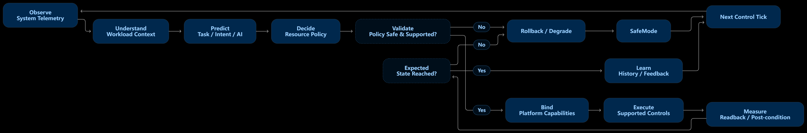

[英文](ARCHITECTURE.md) | [中文](ARCHITECTURE.zh-CN.md)

# 产品框架

## AICore 概览

AICore 连接三个商业视角：用户希望完成什么、应用需要什么，以及设备如何更好地支持体验。由此形成面向自适应个人计算的独特产品层。

## 自适应控制循环

AICore 持续连接观察、工作负载理解、预测、策略验证、受支持的执行、结果测量、恢复和反馈。该图呈现产品层控制模式，不公开实现细节。

## 体验原则

### 理解情境

产品把不断变化的用户重点、工作负载特点和设备状态作为一个整体体验进行理解。

### 协调整机

AICore 把计算机视为统一产品，而不是彼此割裂的资源和工具集合。

### 持续适应

随着使用模式、应用和设备产品组合变化，体验能够变得更加贴合需求。

### 保持信任

可控性、透明度、用户选择和负责任的行为始终是产品价值主张的核心。

## 生态角色

AICore 旨在与操作系统、硬件平台、应用和企业管理体系形成互补。因此，它适合进入更广泛的产品组合，同时保留现有生态合作伙伴的价值。

## 扩展能力

产品理念可以扩展到消费设备、专业工作站、企业终端组合和专业计算市场，同时保持一致的 AICore 品牌身份。

## 战略成果

对客户而言，AICore 代表更具感知能力和响应能力的计算机。对商业所有者而言，它代表可用于差异化、合作和持续价值创造的可复用平台。
