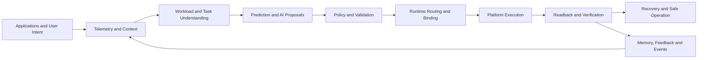

[English](PROJECT_STRUCTURE.md) | [Chinese](PROJECT_STRUCTURE.zh-CN.md)

# AICore Project Structure

## Engineering profile

AICore is an independently developed, multi-component Rust workspace for Windows and Linux. It combines platform observation, contextual intelligence, policy-driven coordination, controlled execution, verification, recovery, memory, and application integration in one product system.

The project is structured so that platform-specific behavior remains separated from reusable product logic. This allows the same product model to extend across operating systems, hardware portfolios, and commercial deployments.

## End-to-end system flow

This flow gives the project a complete operating model: observe the machine, understand the active work, prepare a decision, validate it, execute through the available platform, verify the result, and retain useful feedback.

## Functional structure

| Functional area | Responsibility | Product value |
|---|---|---|
| Platform capability and telemetry | Discovers available device capabilities and observes current system conditions | Allows AICore to respond to the actual computer rather than a fixed hardware assumption |
| Context and workload understanding | Represents application activity, user priorities, workload type, and system state | Creates the situational awareness required for adaptive computing |
| Application and task integration | Supports transparent observation, declared task intent, and native task submission | Enables adoption across existing and purpose-built applications |
| Prediction and intent intelligence | Uses local models and optional language intelligence to interpret or anticipate needs | Adds forward-looking and natural interaction capabilities |
| Policy and validation | Converts context into resource decisions and checks them against rules and permissions | Keeps intelligent behavior controlled and explainable |
| Runtime coordination | Separates time-sensitive control from slower preparation and selects an execution path | Preserves responsiveness while allowing richer intelligence |
| Platform execution | Applies supported operating-system and hardware actions through platform-specific providers | Connects product decisions to real device behavior |
| Readback and verification | Compares the requested outcome with the observed result | Distinguishes an attempted action from an achieved effect |
| Recovery and safe operation | Supports rollback, degraded operation, and safe-state behavior | Protects user trust when conditions change or actions fail |
| Memory and feedback | Retains consent-aware history and observed outcomes for personalization and learning | Builds longer-term relevance for users and organizations |
| Plugins and external integration | Extends capabilities through controlled, identity-aware integration | Creates a partner ecosystem without weakening product boundaries |
| Operational experience | Provides daemon, command-line, dashboard, service-hosting, and benchmark surfaces | Makes the system operable, observable, and demonstrable |

## Application integration levels

AICore supports three complementary forms of application participation:

| Level | Integration model | Intended use |
|---|---|---|
| L0 | Transparent observation of existing applications | Broad compatibility without requiring application changes |
| L1 | Applications declare task context and resource intent | Richer coordination with limited integration effort |
| L2 | Applications submit and manage native AICore tasks | Deep integration for products designed around adaptive computing |

These levels allow partners to choose the depth of integration appropriate to their product and customer base.

## Platform model

| Platform area | Public description |
|---|---|
| Windows | Native platform integration for telemetry, processes, power, local communication, and available device capabilities |
| Linux | Native platform integration using Linux system facilities and capability discovery |
| Simulated platform | In-memory environment for repeatable control-flow, recovery, and product demonstrations |
| Model execution | Local inference paths for prediction, classification, and intent interpretation |

The core product logic consumes common data and capability descriptions. Operating-system differences stay within the platform layer, which supports portability and partner-specific expansion.

## Private repository organization

The private engineering repository is organized into the following top-level groups:

| Repository group | Purpose |
|---|---|
| `contracts/` | Shared product data, states, errors, and component contracts |
| `core/` | Context, policy, validation, execution semantics, verification, and safety logic |
| `runtime/` and `runtime-router/` | Control loops, policy handoff, routing, and runtime binding |
| `adapters/` | Windows, Linux, and simulated platform integration |
| `ai/`, `ai-runtime/`, and `models/` | Prediction, intent, local inference, and model assets |
| `tier/`, `tier-l0/`, `tier-l1/`, `tier-l2/`, and `task-runtime/` | Application compatibility levels and task lifecycle |
| `memory/` | Persistent history, personalization, retention, and feedback data |
| `api/`, `ipc/`, and `plugin/` | Application access, local communication, identity, trust, and extensions |
| `apps/` and `service-host/` | Daemon, command-line, dashboard, benchmarks, and service integration |
| `tests/`, `scripts/`, `deploy/`, and `docs/` | Verification, automation, delivery assets, and product documentation |

This organization keeps contracts, product logic, platform code, AI providers, applications, and verification assets independently maintainable while preserving a single product direction.

## Safety structure

AICore separates intelligence from authority. Predictions and language-based intent can propose actions, but the control path still applies policy validation, permission checks, capability checks, execution status, readback, and recovery handling.

The project distinguishes success, skipped work, unsupported capability, failed execution, and actions that produce no effect. This prevents simulated, unavailable, or unexecuted behavior from being represented as a real device outcome.

## Commercial relevance

This structure demonstrates that AICore is a complete systems product rather than a single optimization feature. An acquirer receives a layered software foundation spanning product intelligence, platform integration, application participation, safety, memory, extensibility, and operational experience.

Deeper implementation materials, development history, and product demonstrations are available to qualified parties through a controlled due-diligence process.
