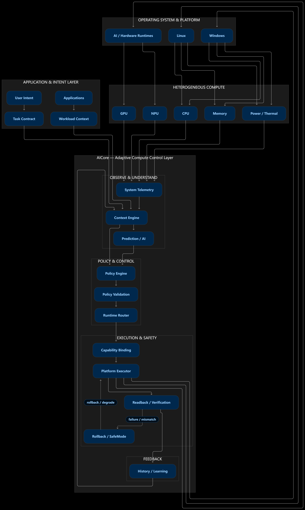
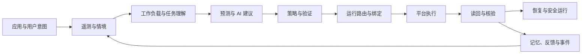

[英文](PROJECT_STRUCTURE.md) | [中文](PROJECT_STRUCTURE.zh-CN.md)

# AICore 项目结构

## 工程概况

AICore 是一个由个人独立开发、面向 Windows 和 Linux 的多组件 Rust 工作区。它把平台观察、情境智能、策略协调、受控执行、结果核验、恢复、记忆和应用接入组合成一个完整产品系统。

项目在结构上将平台专属行为与可复用产品逻辑分离，使同一产品模型能够扩展到不同操作系统、硬件产品组合和商业部署环境。

## 端到端系统流程

这一流程为项目提供完整运行模式：观察计算机、理解当前工作、准备决策、验证决策、通过可用平台执行、核验结果，并保留有价值的反馈。

## 功能结构

| 功能领域 | 职责 | 产品价值 |
|---|---|---|
| 平台能力与遥测 | 发现可用设备能力并观察当前系统状态 | 让 AICore 根据实际计算机作出响应，而不是依赖固定硬件假设 |
| 情境与工作负载理解 | 表达应用活动、用户重点、工作负载类型和系统状态 | 为自适应计算建立所需的情境感知能力 |
| 应用与任务接入 | 支持透明观察、任务意图声明和原生任务提交 | 同时适配现有应用和专门设计的应用 |
| 预测与意图智能 | 使用本地模型和可选语言智能理解或预判需求 | 增加前瞻能力和自然交互能力 |
| 策略与验证 | 把情境转化为资源决策，并依据规则和权限进行检查 | 让智能行为保持可控且易于解释 |
| 运行协调 | 分离时间敏感控制与较慢的准备过程，并选择执行路径 | 在引入更丰富智能的同时保持响应速度 |
| 平台执行 | 通过平台专属提供方应用操作系统和硬件支持的动作 | 把产品决策连接到真实设备行为 |
| 读回与核验 | 对比请求结果与实际观察结果 | 区分尝试执行与真正产生效果 |
| 恢复与安全运行 | 支持回滚、降级运行和安全状态 | 在条件变化或动作失败时保护用户信任 |
| 记忆与反馈 | 在征得同意的前提下保留历史和观察结果，用于个性化与学习 | 为用户和组织建立长期相关性 |
| 插件与外部接入 | 通过受控且能够识别身份的方式扩展能力 | 在不削弱产品边界的前提下建立合作生态 |
| 运行体验 | 提供守护程序、命令行、仪表板、服务承载和基准评估入口 | 让系统可运行、可观察且可以演示 |

## 应用接入层次

AICore 支持三种相互补充的应用参与方式：

| 层次 | 接入模式 | 适用场景 |
|---|---|---|
| L0 | 透明观察现有应用 | 无需修改应用即可获得广泛兼容性 |
| L1 | 应用声明任务情境和资源意图 | 以较低接入成本获得更丰富的协调能力 |
| L2 | 应用提交并管理 AICore 原生任务 | 面向围绕自适应计算设计的产品进行深度接入 |

这些层次让合作伙伴能够根据自身产品和客户群选择合适的接入深度。

## 平台模型

| 平台领域 | 公开说明 |
|---|---|
| Windows | 面向遥测、进程、电源、本地通信和可用设备能力的原生平台接入 |
| Linux | 使用 Linux 系统设施和能力发现进行原生平台接入 |
| 模拟平台 | 用于重复演示控制流程、恢复过程和产品行为的内存环境 |
| 模型执行 | 用于预测、分类和意图理解的本地推理路径 |

核心产品逻辑使用统一的数据与能力描述。操作系统差异保留在平台层，从而支持可移植性和合作伙伴专属扩展。

## 私有仓库组织

私有工程仓库由以下顶层组构成：

| 仓库组 | 用途 |
|---|---|
| `contracts/` | 共享产品数据、状态、错误和组件契约 |
| `core/` | 情境、策略、验证、执行语义、核验和安全逻辑 |
| `runtime/` 和 `runtime-router/` | 控制循环、策略交接、路由和运行绑定 |
| `adapters/` | Windows、Linux 和模拟平台接入 |
| `ai/`、`ai-runtime/` 和 `models/` | 预测、意图、本地推理和模型资产 |
| `tier/`、`tier-l0/`、`tier-l1/`、`tier-l2/` 和 `task-runtime/` | 应用兼容层次和任务生命周期 |
| `memory/` | 持久历史、个性化、保留策略和反馈数据 |
| `api/`、`ipc/` 和 `plugin/` | 应用访问、本地通信、身份、信任和扩展 |
| `apps/` 和 `service-host/` | 守护程序、命令行、仪表板、基准评估和服务接入 |
| `tests/`、`scripts/`、`deploy/` 和 `docs/` | 验证、自动化、交付资产和产品资料 |

这种组织方式使契约、产品逻辑、平台代码、AI 提供方、应用和验证资产能够独立维护，同时保持统一的产品方向。

## 安全结构

AICore 将智能与权限分离。预测和语言意图可以提出建议，但控制路径仍会执行策略验证、权限检查、能力检查、执行状态处理、结果读回和恢复处理。

项目区分成功、跳过、不支持、执行失败以及没有产生效果的动作，避免把模拟、不可用或没有执行的行为表示为真实设备结果。

## 商业意义

这一结构表明，AICore 是完整的系统产品，而不是单项优化功能。收购方能够获得覆盖产品智能、平台接入、应用参与、安全、记忆、扩展能力和运行体验的分层软件基础。

更深入的实现材料、开发历史和产品演示可通过受控尽调流程向合格意向方提供。
